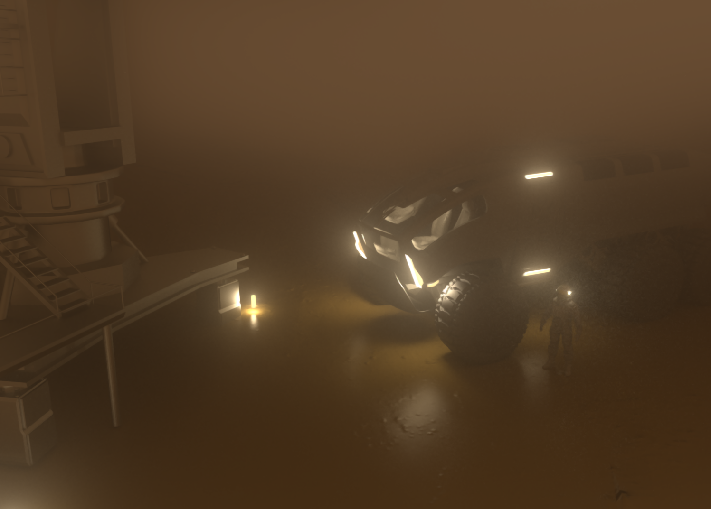

# MSoA-Project
Developed a rendering engine based on Nori for the Modeling and Simulation of Appearance course.

### Features implemented for the final project:
    - Multiple Scattering in Homogeneous Media for the dust storm.
    - Normal Mapping for the spacesuit, the rover and the planet surface.

Image submited to the rendering contest:

The_Martian_10000ppp

### Addiitonal Figures uploaded to Drive
https://drive.google.com/drive/folders/1ykA-Cyz1bjNYbH_O64RXGQ7IDtYwhyjl?usp=sharing

